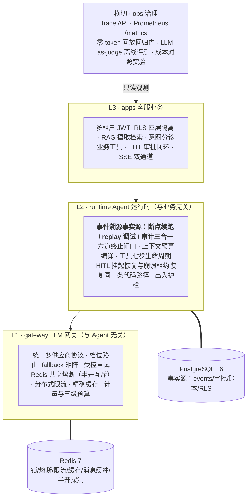

# Aegis — 多租户客服 Agent 平台

> **"LLM 是 CPU，Aegis 是操作系统。"**（ADR-001）
> 一个证明"造平台"而非"用平台"的工程项目：不依赖 Agent 框架，自研运行时解决七类工程问题——
> 循环失控、工具不可信、上下文爆炸、上游故障、并发与成本失控、不可观测、不安全。

## 架构



依赖方向严格单向，CI 强制：`api|workers → apps|obs → runtime → gateway → core`（import-linter）。
数据面立场：PG 是唯一事实源（不可用=服务不可用，快速失败）；Redis 六角色全部可降级
（会话锁降 PG advisory、熔断限流缓存粘滞降级——互斥与安全语义不放弃）。

## 高光能力（每行凭证可复跑）

| 能力 | 一句话 | 凭证 |
|---|---|---|
| 断点续跑三合一 | 挂起审批 → kill 副本 → 断连批准，事实面照样闭环；HITL 恢复与崩溃恢复同一条代码路径 | [docs/demo-script.md](docs/demo-script.md) 高光2 |
| 故障注入下的可靠性 | 30% 上游失败 1000 次成功率 100%；熔断打开后毫秒级拒绝零穿透 | [reports/m1_fault_injection.txt](reports/m1_fault_injection.txt) |
| 多租户隔离 | RLS+归属校验+租户缓存键+检索过滤四层；staff 越界 403 点名、user 面 404 隐身 | demo 高光3 / `tests/apps/test_rls.py` |
| 零 token 回放门 | 11 盘录制会话 CI 确定性重放，行为等价性断言值守 prompt 变更 | `tests/replay/` + [reports/m4_replay_redgreen.txt](reports/m4_replay_redgreen.txt) |
| 离线质量评测 | LLM-as-judge 三类判据分层（机器绊线只管召回、判定权分类收放） | [docs/eval-rubrics.md](docs/eval-rubrics.md) |
| 成本工程 | 档位路由+精确缓存两组对照实验，口径写死、账本可复算 | [reports/m4_cost_routing.txt](reports/m4_cost_routing.txt) / [m4_cost_cache.txt](reports/m4_cost_cache.txt) |
| 水平扩展 | api×3 无宿主端口 + nginx 单入口（SSE 两坑已治）；压测三档 0 错误 | [reports/m5_loadtest_overhead.txt](reports/m5_loadtest_overhead.txt) |

## 快速启动

容器全栈（Linux 语义完整形态；migrate 一次性前置，入口只有 nginx `127.0.0.1:8080`）：

```powershell
Copy-Item .env.example .env                          # 填 DASHSCOPE_API_KEY / JWT_SECRET
docker compose -f deploy/docker-compose.yml up -d --scale api=3
uv sync                                              # 宿主侧工具链（种子/签发/演示脚本）
uv run python scripts/seed_demo.py                   # 两租户演示种子（语料真实摄取 <¥0.02）
uv run python scripts/mint_token.py u-a1             # 签发演示 JWT
# 打开 http://127.0.0.1:8080/chat 粘贴 token 对话；15 分钟 demo 见 docs/demo-script.md
```

本地开发形态（PG/Redis 用容器、应用跑宿主）：

```powershell
uv run uvicorn aegis.api.main:create_app --factory   # http://127.0.0.1:8000/chat
```

测试与质量门（CI 十二道，测试全程零真实 LLM 调用）：

```powershell
uv run pytest -q          # 全量（1003 条）
uv run mypy . ; uv run ruff check . ; uv run lint-imports
```

## 实测数字（口径限定语随数字走；每个数字在 `reports/` 有凭证与复算口径，绝不写无凭证数字）

| 数字 | 口径 | 凭证 |
|---|---|---|
| 端到端成功率 **100%**（P99 2.42s） | 故障注入实验：30% 上游失败 ×1000 次真实调用 | [m1_fault_injection.txt](reports/m1_fault_injection.txt) |
| 熔断恢复闭合 **≤32.5s**（三轮 31.7–32.5s） | 上游恢复→探针成功且键清零；open TTL 30s 主导 | [m5_breaker_recovery.txt](reports/m5_breaker_recovery.txt) |
| 档内容灾切换 **20/20** | qwen-plus 100% 注入下 standard 档全数落 qwen-turbo，ledger 计费同步切换 | [m5_failover_qwen_tier.txt](reports/m5_failover_qwen_tier.txt) |
| 评测 40 用例稳定基线 **95%** | 两条已知失败有名有姓不美化；judge spot-check ±1 一致率 100% | [eval_baseline_20260803.txt](reports/eval_baseline_20260803.txt) |
| 档位路由降本 **74.7% / 18.9%** | 双基线（vs-strong/vs-standard）防"基线选贵抬数字"；80 条全唯一集、缓存关 | [m4_cost_routing.txt](reports/m4_cost_routing.txt) |
| 精确缓存降本 **21.9%** | 30% 历史复述假设显式声明；请求级全命中自检 60/60 | [m4_cost_cache.txt](reports/m4_cost_cache.txt) |
| 本地压测三档 **0 错误**、平台自身开销 **P99 ≤1.4s** | 模拟上游延迟（800ms+20tok/s 注入）；开销=TTFT−注入基线 21.6s；60 并发档 | [m5_loadtest_overhead.txt](reports/m5_loadtest_overhead.txt) |
| 真实上游首 token **P50 1.31s**（P99 4.1s） | N=100 串行 standard 档；不做高并发（费用与厂商限流） | [m5_real_first_token.txt](reports/m5_real_first_token.txt) |
| 分布式限流精度误差 **0.76%** | 多副本 521/525 放行复测 | [m2_ratelimit_retest.txt](reports/m2_ratelimit_retest.txt) |
| kill -9 摄取恢复 **102s 零人工** | Linux 容器 SIGKILL 实录，账本零重复计费 | [m4_kill9_ingest_linux.txt](reports/m4_kill9_ingest_linux.txt) |

## 15 分钟 Demo

[docs/demo-script.md](docs/demo-script.md)——四高光（故障注入与熔断／断点续跑全弧／多租户隔离
四连／trace+回放门）四列分镜：操作、预期画面、讲稿、失败预案；排练计时实测登记。
驱动器：`uv run python scripts/demo_m5_highlights.py prep|h1|h2|h3|h4|all`。

## 文档地图（`docs/`，文档变更走提交）

| 入口 | 内容 |
|---|---|
| [docs/00-master-plan.md](docs/00-master-plan.md) | **执行主文档**：M0→M5 全程步骤/口径表/横切清单/交付对账 |
| [docs/02-architecture.md](docs/02-architecture.md) | 三层架构 / 表结构 / 安全矩阵 / 降级清单 |
| [docs/03-agent-runtime-design.md](docs/03-agent-runtime-design.md) | L2 运行时详设（循环/上下文/工具/事件/回放契约） |
| [docs/atlas.md](docs/atlas.md) | 全景复习图册：分层图组/闸门总表/数字凭证卡/失败哲学/已知边界 |
| [docs/adr/](docs/adr/) | 7 篇架构决策记录（为什么自研、单 Agent、async、Redis 角色…） |
| [docs/retro-m0-m1.md](docs/retro-m0-m1.md) · [retro-m2](docs/retro-m2.md) · [retro-m3](docs/retro-m3.md) | 里程碑复盘（缺陷终局对账/哲学/连环炮） |
| [docs/eval-rubrics.md](docs/eval-rubrics.md) | 离线评测判据（三类用例/五档锚定/spot-check 流程） |
| [docs/interview-questions.md](docs/interview-questions.md) | 面试深挖题库（含每题出题背景与答案锚点） |
| [reports/](reports/) | 全部对外数字的实测凭证 |

## AI 协作声明

本项目由我与 AI 结对完成，不隐瞒、不缩水：架构裁决、每一处口径与取舍、验收对账、缺陷
发现全程在我；生产代码 M0–M4.5 由我亲手敲入（AI 出初稿与对抗评审），M4.6 起交付尾程
按登记的规约例外全量委托 AI 执行、我做拍板与逐项验收（00 §2.1 留档）。测试自 M2.2 起由
AI 直写、我定验收口径并清单对账。项目自身的验收纪律——凭证化数字、清单对账、对抗评审、
回放门——就是"怎么验证 AI 产出"这个 2026 年必答题的我的答案（详见
[docs/05-resume-and-interview.md](docs/05-resume-and-interview.md) §4）。
