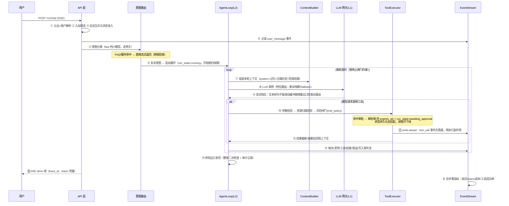

# 02 · 总体架构

> v1.1 · 已吸收四视角评审（面试官/架构师/可行性/一致性）的修订意见。

## 1. 分层总览

```
┌─────────────────────────────────────────────────────────────┐
│  API 层（FastAPI · 无状态 · 多副本水平扩展）                    │
│  认证/租户解析 → 入站限流 → 会话互斥 → SSE 流式出口              │
├─────────────────────────────────────────────────────────────┤
│  L3 业务层：客服 Agent                                        │
│  意图路由 · 主 Agent · 多租户 RAG · 业务工具 · HITL · 转人工    │
├─────────────────────────────────────────────────────────────┤
│  L2 Agent 运行时（Harness）— 与业务无关，可承载任意 Agent       │
│  AgentLoop · ContextBuilder · ToolExecutor · EventStream ·   │
│  Guardrails · 恢复调度                                        │
├─────────────────────────────────────────────────────────────┤
│  L1 LLM 网关 — 与 Agent 无关，可服务任意上层应用                │
│  多供应商适配 · 档位路由 · 重试/熔断/超时 · 出站限流 ·           │
│  租户隔离缓存 · Token/成本核算                                 │
├─────────────────────────────────────────────────────────────┤
│  基础设施：PostgreSQL(+pgvector) · Redis · Celery Workers     │
└─────────────────────────────────────────────────────────────┘
```

**分层纪律（面试深挖点）**：
- L1 不知道"Agent"的存在——它只见到 `LLMRequest`，任何上层应用都能用；
- L2 不知道"客服"的存在——工具、prompt、策略全部由 L3 注入，换个业务场景 L2 零修改；
- L3 不直接碰供应商 SDK——所有模型调用必须走 L1；
- 依赖方向严格单向：L3 → L2 → L1，禁止反向 import（CI 里用 import-linter 强制）。

**限流的两级分工**：API 层限**入站**用户请求速率（租户维度，保护自身）；
L1 限**出站**供应商调用（provider + 租户两维度，保护配额与成本）。两级各司其职，不是重复。

## 2. 一条消息的完整旅程

用户发一条"我上周买的耳机想退款"，系统内部发生的 16 步：



关键细节：

- **③ 会话互斥**：Redis 会话锁（owner token + Lua compare-and-delete 释放，看门狗续期）。
  锁被占（上一条还在处理）→ 返回 409"上一条消息处理中"，前端禁用发送（v1 策略；pending 队列列入 v2）；
- **③ 消息准入**：会话处于 `awaiting_approval` 时新消息**不开新循环**——系统提示"有待审批操作进行中"；
  用户明确取消 → 记 `approval_cancelled` 事件、审批单置 `cancelled`、挂起的 run 优雅终止。
  防止"审批通过后基于过时意图执行退款"；
- **⑨ 流式出口防护（设计取舍，面试深挖点）**：token 不能"先流出再检查"。策略：按句子攒缓冲，
  增量检查（system prompt 片段/内部工具名/PII 正则等高危模式做前缀匹配，命中即截断替换）后放行，
  代价是首字延迟增加约一个句子的生成时间；⑭ 的终局复检覆盖整体语义层面的检查 + 事后审计告警。
  强拦截保证与流式体验天然冲突，这个 tradeoff 要主动讲；
- **⑩ HITL 挂起**：挂起后原 SSE 连接不必维持。客户端收到 `approval_pending` 帧后改用
  **重订阅通道** `GET /v1/sessions/{id}/stream?after_seq=N`（原生 EventSource + Last-Event-ID）
  接收后续输出——断线重连与审批后续跑共用这一条通道，与事件流 seq 天然对齐；
- **恢复调度**：审批回调只做状态翻转，实际恢复统一走"先取会话锁再恢复"的单入口；
  崩溃的 run 由 reaper 按租约扫描认领（详见 [运行时详设 §5](03-agent-runtime-design.md)）；
- **兜底路径**（图中省略）：检索无结果 → 兜底话术；循环达上限 / 用户要求 → 转人工工单并携带上下文摘要。

## 3. 数据模型（核心表）

> **对账注（2026-07-24 M3.0 走查登记）**：本表为规划期快照，与已落库迁移存在列级漂移
> （events 多 run_id；sessions 多 lease_generation/recovery_count；tool_invocations 实列名
> `tool_name` 且多 4 列；messages 多 event_id）——**实际列结构一律以 `migrations/versions/`
> 实文件为准**（plans/m3-detailed 附录 U2 的处置兑现）。

| 表 | 关键字段 | 说明 |
|---|---|---|
| `tenants` | id, name, config(jsonb 含审批阈值等), token_budget_monthly | 租户与配额。**config 治理（M3.1/#21/D12）**：种子脚本初始化、运行期只读（无修改端点），变更=改 `scripts/seed_demo.py` 重跑（upsert 幂等）或手工 SQL |
| `users` | id, tenant_id, role(user/operator/admin) | 所有业务表都带 tenant_id |
| `sessions` | id, tenant_id, user_id, **run_state**(idle/running/awaiting_approval/failed), **lease_owner, lease_expires_at**, summary | run_state+租约支撑恢复调度 |
| `messages` | id, session_id, role, content, token_usage | 对话原文（**事件流的投影**，见下） |
| `events` | id, session_id, **seq**, type, **schema_version**, payload(jsonb **存原文**), created_at | **状态恢复的唯一事实源**；seq 由持会话锁的单写者递增，`(session_id, seq)` 唯一约束兜底并发；schema_version 支撑事件格式演进 |
| `documents` / `chunks` | tenant_id, source, text, embedding vector(1024), **embedding_model**, meta | RAG 语料；HNSW 索引；embedding_model 列支撑换模型灰度 |
| `tool_invocations` | id, event_id, tool, args, result_digest, status, latency_ms | 工具审计（投影） |
| `approvals` | id, session_id, tenant_id, tool_name + args(参数快照), status(pending/approved/rejected/**cancelled/expired**), **expires_at**, operator_id, decided_at, event_id(执行后回填) | HITL 审批单，超时与撤回是一等状态；**不挂 tool_invocation 外键**——03 §4 中审批先于 write-ahead，审批的是参数快照（2026-07-08 M2.2 同步） |
| `usage_ledger` | tenant_id, session_id, request_id, model, prompt_tokens, completion_tokens, cost | **明细到请求**；聚合维度统一为租户/会话/模型/天 |
| `eval_cases` / `eval_runs` | case 定义与每次回归结果 | 评测集与趋势 |

**事件与投影的关系（事件溯源流派的必考题）**：`messages`、`tool_invocations`、`sessions.summary`
是事件流的**投影**，在写入事件的同一个 PG 事务内同步派生——单库架构让"事件+投影同事务"零成本获得
（这也是 pgvector 单库选型的隐藏红利，见 ADR-006）。不一致时以 events 为准，nightly 对账脚本核验。

**多租户隔离**：应用层强制（所有查询经带 tenant_id 的 Repository）+ PG 行级安全兜底
（RLS 落地要点见 §7，有真实的坑）。

## 4. L1 网关设计要点

```
LLMRequest ──> 档位路由(fast/standard/strong → provider+model, 租户可覆盖)
           ──> 精确缓存(key = tenant_id + prompt_hash, 跨租户绝不命中)
           ──> 出站限流(Redis 令牌桶 Lua 原子, provider+租户两维度)
           ──> 调用(httpx 连接池复用, 连接/读取超时分离)
                 失败 → 受控重试(见下)
                 连续失败 → 熔断(Redis 共享状态, 半开探测互斥)
                 耗尽 → 按档位 fallback 矩阵 → 业务级降级
           ──> 计量(每次调用写 usage_ledger 明细, 附 trace_id)
```

- **模型档位**：`fast`（意图分类/摘要压缩）、`standard`（普通对话）、`strong`（复杂推理/工具编排）。
  调用方声明档位而不是模型名——换模型是配置变更；
- **重试语义（用词要严谨——重试的前提是请求无业务副作用，不是"错误幂等"）**：
  LLM 补全/embedding 请求本身无业务副作用、可重复执行，代价只是重复计费，故重试预算受限
  （单请求最多 3 次尝试 + 总时限）。可重试：429（读 Retry-After）、408、502/503/504、连接错误、读超时；
  不可重试：其余 4xx（参数错误重试无意义）、501。除 429 外每次失败计入熔断统计窗口
  （429 是配额信号不是健康信号，不进熔断账——M1 实装定稿，2026-07-06 同步，见 00 §2.2）；
- **熔断半开探测互斥**：进入半开后用 SET NX 抢探测令牌，抢到的副本放行一个真实请求，
  其余副本半开期间直接走 fallback；探测结果用 Lua 原子更新状态机——避免多副本同时探测
  对刚恢复的上游打突发流量；
- **熔断粒度（已知取舍，2026-07 审计落档）**：熔断按 provider 粒度记账——同供应商多模型
  共享失败计数，单模型局部故障可能连累同平台候选。保留此粒度的理由：保护的是平台级
  配额与连接层；且"连续 5 次重试耗尽"在有成功穿插时极难误触发。若实测出现误伤，
  升级路径是熔断 key 细化为 provider:model；
- **fallback 按档位分矩阵，不做能力断崖**：`fast` 档主→备供应商，耗尽可升档到 standard（成本可接受）；
  `standard`/`strong` 档只在同能力级供应商间横跳，耗尽后直接走业务级降级（兜底话术+转人工），
  绝不降到小模型硬撑工具编排（Ollama 本地档列入 v2）；
- **tool-call 跨供应商规范化（M1 实现量最大的部分，显式设计）**：平台内部统一抽象——
  `LLMRequest.tools` 用内部 JSON Schema 表示，流式响应统一为 `LLMChunk` 事件
  （text_delta / tool_call / usage / stop）；各 provider 适配器负责双向映射，
  **含中途 fallback 换供应商时历史消息里 tool_call/tool_result 的格式转换**。
  v1 简化：文本流式、工具调用轮整体接收后回给运行时（流式 tool-call 增量解析列入 v2）；
- **缓存的租户隔离（头号安全卖点不能在缓存旁路上翻车）**：精确缓存 key 强制以 tenant_id 前缀；
  "租户 A 高频问题在租户 B 侧不得命中"列入 M3 对抗测试。
  语义缓存整体列入 v2（方案已定：pgvector `semantic_cache` 表 + 租户分区 + 仅限无状态 FAQ 档，
  为什么不放 Redis 见 ADR-005）；
- **token 预算三级闸门**：单请求、会话、租户月度，任一触发返回明确错误码，不静默劣化。

## 5. 可靠性设计要点

| 故障 | 应对 | 演示方法 |
|---|---|---|
| 供应商超时/限流 | 受控重试 → 熔断 → 档位 fallback 矩阵 | 故障注入开关（配置化失败率），报告成功率与 P50/P99 两组数字 |
| 进程崩溃/发布重启 | 事件流即状态：reaper 按租约认领，重放恢复 | kill -9 执行中的 Agent，重启后从断点继续 |
| **PostgreSQL 不可用/抖动** | 事件写入短退避重试 3 次，仍失败 → 终止本次 run 返回明确错误。**PG 挂 = 服务不可用，显式接受**（事件流是事实源，不能在无事实源时假装工作）。tool_call 事件必须在副作用前同步落盘（write-ahead）；usage 明细/指标类可异步批量 | 停 PG 容器，验证无半执行副作用、错误信息明确 |
| 重复请求 | 会话锁 + 请求幂等键；工具层 write-ahead 事件 id 透传下游去重 | 双击发送不产生两笔退款 |
| RAG 检索为空 | 置信度阈值 + 兜底话术 + 建议转人工 | 提问知识库外问题 |
| Agent 循环失控 | 六道终止闸门（其中最大轮数/预算/重复检测三道针对失控） | 构造诱导循环的 bad case |
| Redis 不可用 | 限流/缓存退化本地内存（本地配额=全局/副本数）；熔断 fail-open + 本地计数（M1.12 实装实录）；**会话互斥降级为 PG advisory lock**（**session 级 `pg_advisory_lock`** + 专用连接持有显式释放 + `hashtext(session_id)` 稳定哈希——事务级 xact lock 首事务提交即释放撑不住跨事务 run、Python `hash()` 跨副本不稳定，两个坑见 ADR-005，2026-07-07 评审 C4 修正）；Celery 补投列入 v2，**reaper 恢复调度随 broker 停摆（已接受降级，Redis 恢复后自愈——评审 C7 落档）** | 停 Redis 容器，核心对话链路不断 |

**发布与停机语义（crash-only 立场，2026-07-07 评审 C35 落档）**：本系统**不做优雅排水**——
发布/重启与崩溃走同一条恢复路径（事件流 + 租约 + reaper），"恢复是日常而非例外"是主动立场。
SIGTERM 下 in-flight SSE 直接断开，客户端经重订阅通道续收；运行中 run 的租约过期后由 reaper
认领续跑。已知细节：uvicorn 默认 graceful shutdown 会等存量连接，SSE 长连接会拖住关闭——
部署清单里 `--timeout-graceful-shutdown` 设短值，主动选择快停。代价：发布瞬间活跃会话感知
一次断线重连（与崩溃恢复演示是同一个体验）。

**备份口径（2026-07-07 评审 C41 落档）**：§5 故障表覆盖的是"PG 不可用"（快速失败），
"PG 数据丢失"另有答案——v1 演示环境：`pg_dump` 按需一份 + 演示数据可由种子脚本全量重建；
生产形态答案是 PITR（WAL 归档 + base backup），只写思路不实操（与 K8s 同级的范围裁剪）。
误操作红线：`docker compose down -v` 会抹掉 pg_data 卷。

## 6. 并发与性能设计要点

- **全栈 asyncio**：LLM 调用挂起数十秒等 token，async 单进程可挂上万等待协程；
  线程模型做同等并发**资源成本差一个数量级**（每线程独立栈+内核调度 vs KB 级堆对象——
  不是"不可行"，Java 线程模型服务端跑了二十年，是效率与成本问题，表述要经得起追问，
  详见 [ADR-004](adr/ADR-004-async-first.md)）；
- **三处连接池**：SQLAlchemy async engine（pool_size/max_overflow 显式配置）、redis-py 内置池、
  httpx.AsyncClient 单例（keep-alive 复用，省高并发下的 TLS 握手）；
- **慢活不进事件循环**：文档解析/切块（CPU 密集）与批量 embedding 调用
  （百炼 text-embedding-v4，IO 密集但耗时长、受供应商限流）全部走 Celery worker，
  不阻塞 API 进程；API 进程内偶发 CPU 活用 `run_in_executor`；
- **水平扩展**：API 层无状态（状态在 PG+Redis），`docker compose up --scale api=3` + Nginx 演示；
  限流、熔断状态、会话锁都在 Redis，多副本行为一致。

## 7. 安全设计要点

### 7.1 认证与授权

- **凭证形态**：终端用户 = 租户侧签发的短期 JWT（sub=user_id, tid=tenant_id）；
  坐席/管理员 = 平台账号登录 + RBAC；
- **端点 × 角色矩阵**：

| 端点 | user | operator | admin |
|---|---|---|---|
| `POST /v1/chat`、`GET /v1/sessions/{id}/stream` | ✅ 仅本人会话 | — | ✅ |
| `GET /v1/sessions/{id}/events`（完整 trace） | ❌ **终端用户不可见**（trace 含 system prompt、内部工具名——开放即出口防护的旁路泄漏） | ✅ 仅本租户 | ✅ |
| `POST /v1/approvals/{id}` | ❌ | ✅ 仅本租户（强制校验 `operator.tenant_id == approval.tenant_id`） | ✅ |
| `POST /v1/kb/documents`、`GET /v1/usage` | ❌ | ✅ 仅本租户 | ✅ |
| `GET /metrics`（M4.2 拍板 2026-08-03） | **无认证**（三角色列不适用）——防线=端口全程只绑 127.0.0.1（00 §2.2 安全底线）；生产形态应内网隔离或加 basic auth（模块 docstring 已声明）。scrape 全程只读，DB 派生刷新走平台维护面（D4） | 同左 | 同左 |

"租户 A 的坐席审批租户 B 的审批单必须 403"列入 M3 对抗测试。

**登录形态取舍（2026-07-24 M3.0 P7 拍板）**：v1 不做坐席/管理员登录端点（users 表无凭证列），
演示 token 统一由 `scripts/mint_token.py` 签发；"平台账号登录"的完整形态列 v2。对端点×角色
矩阵与四大对抗验收零影响——RBAC 语义由 JWT role 声明 + `require_roles` 依赖完整承载。

### 7.2 多租户与资源级隔离（三层）

1. **租户层**：应用层 Repository 强制 tenant_id + **RLS 兜底的落地要点**（不写清就等于没有）：
   每事务开始经 SQLAlchemy 事务钩子执行 `SET LOCAL app.tenant_id = :tid`
   （连接池跨请求复用连接，session 级 SET 会把上一个请求的租户带给下一个——必须 LOCAL）；
   应用用**非 owner、无 BYPASSRLS 的低权角色**连接（owner 默认绕过 RLS，兜底防线才真实存在）；
   策略 `USING (tenant_id = current_setting('app.tenant_id')::uuid)`；
   集成测试：绕过 Repository 的裸 SQL 必须返回空集、并发双租户请求不串上下文；
   **RLS v1 覆盖范围（2026-07-24 M3.0 P5 拍板）**：仅覆盖带 tenant_id 列的表
   （tenants/users/sessions/approvals/usage_ledger/documents/chunks/mock_orders/mock_write_ops）；
   events/messages/tool_invocations 无 tenant_id 列、不在 RLS 内——其防线 = 端点×角色矩阵
   （终端用户不可见 trace）+ 会话归属校验（00 §10.1 #19）+ 应用层 Repository。属已知取舍：
   补列需改 M2 冻结的事件写路径并过回放兼容评估，对四大对抗场景零增益；
2. **用户层（防水平越权）**：工具执行以运行时注入的 `(tenant_id, user_id)` 上下文为准——
   **LLM 可控参数与运行时注入参数严格分离**，LLM 给的 order_id 只是查询条件，
   归属校验 `WHERE order.user_id = ctx.user_id` 由工具实现强制；长期记忆检索同样
   tenant_id + user_id 双过滤（**长期记忆 v1 砍出**——00 §10.1 #20 拍板 2026-07-24，
   此句为槽位接口契约与 v2 升级路径描述）。"用户 A 报用户 B 的订单号要求退款"列入 M3 对抗测试；
3. **检索层**：向量检索的 tenant 过滤是 SQL WHERE（越权隔离由 WHERE+RLS 保证）；
   **召回完整性单独保证**——HNSW 的 WHERE 本质是索引内后过滤，小租户可能漏召回，
   方案：pgvector ≥ 0.8.0 开 `hnsw.iterative_scan`，或小租户直接精确扫描（万级 chunk 全扫描既正确又够快），详见 ADR-006。

### 7.3 注入、PII 与出口

- **注入防护分层**：入口规则 + fast 模型可疑度分类 → 检索文档与工具结果一律包裹"不可信数据"标记 →
  真正的安全边界是权限系统（模型拿不到跨租户数据）和 HITL（模型按不下危险按钮），不指望模型自觉；
- **PII 策略（与断点续跑不冲突的设计）**：`events` 存**原文**——它是恢复的唯一事实源，
  脱敏的事件流会让恢复后的上下文与崩溃前不一致（物流工具需要真实手机号）。
  脱敏统一发生在**展示层**：trace 查询 API、日志输出、数据导出走同一个 masker。
  代价：events 表纳入 PII 管控（仅 operator+ 可访问且留审计）——这是主动选择的取舍，要能讲；
- **密钥**：API key 只从环境变量读，`.env` 不入库，日志过滤器兜底；
- **出口安全**：流式路径句子级增量检查 + 高危模式即时截断（见 §2 ⑨），终局整体复检 + 审计告警；
- **数据生命周期（2026-07-07 评审 C21 落档）**：events 含 PII 原文，不允许"无限期保留"不表态。
  v1 口径：演示系统保留期 = 项目生命周期，但 schema 不给治理动作设障碍——保留期策略
  （按租户 `retention_days`，到期归档/删除走 Celery 任务）、租户注销（按 tenant_id 级联删除）、
  用户删除权与事件溯源的冲突（合规删除 = 物理删该用户 events + 投影留 tombstone，
  牺牲该会话可重放性——显式取舍，面试要能讲）。以上 v1 仅文档声明，实装列 v2。

## 8. 代码目录结构（规划）

```
aegis/
├── core/              # 配置(分环境)、db、redis、日志、公共类型
├── gateway/           # L1
│   ├── providers/     #   openai_compat.py（百炼兼容模式：Qwen/DeepSeek）/ anthropic.py（桩测试）
│   ├── schema.py      #   LLMRequest/LLMChunk/统一 tool-call 抽象
│   ├── router.py      #   档位路由
│   ├── resilience.py  #   重试/退避/熔断(半开互斥)
│   ├── ratelimit.py   #   出站令牌桶
│   ├── cache.py       #   精确缓存(租户前缀 key)
│   └── metering.py    #   成本核算
├── runtime/           # L2 (Harness)
│   ├── loop.py        #   AgentLoop（AgentRuntime 门面的内部驱动）
│   ├── context.py     #   ContextBuilder
│   ├── tools/         #   registry.py / executor.py
│   ├── events.py      #   EventStream + 投影
│   ├── recovery.py    #   恢复调度：租约 / reaper / 恢复单入口
│   └── guards.py      #   Guardrails(含流式增量检查)
├── apps/support/      # L3 客服业务
│   ├── agent.py       #   主 Agent 装配(prompt/工具集/策略)
│   ├── intent.py      #   意图路由
│   ├── rag/           #   ingest.py / retrieve.py / rerank.py
│   ├── tools/         #   orders.py / logistics.py / tickets.py / refunds.py / coupons.py
│   ├── mock_backend/  #   模拟业务系统：API 进程内 FastAPI 子应用（延迟/错误率注入可配）
│   └── handoff.py     #   转人工
├── api/               # FastAPI 入口、SSE、中间件(认证/租户/入站限流/会话互斥)
├── obs/               # trace 查询 API、指标、eval 运行器
├── workers/           # Celery 任务(摄取流水线：解析/切块/text-embedding-v4 批量调用)
├── web/               # 聊天页(单文件；审批页为 stretch)
├── tests/             # 单测 + 集成 + 对抗用例 + 评测集
└── deploy/            # docker-compose.yml / nginx.conf / CI
```

## 9. API 草案（核心端点）

| 端点 | 说明 |
|---|---|
| `POST /v1/chat` | 发消息，SSE 流式返回。事件帧：`token` / `tool_status` / `approval_pending` / `done`(trace_id+usage) / `error` |
| `GET /v1/sessions/{id}/stream?after_seq=N` | **重订阅通道**：断线重连与 HITL 审批后续跑输出的统一入口（原生 EventSource + Last-Event-ID） |
| `GET /v1/sessions/{id}/events` | 会话完整 trace（**仅 operator/admin，限本租户**） |
| `POST /v1/approvals/{id}` | 坐席审批（approve/reject；用户侧取消走 chat 语义） |
| `POST /v1/kb/documents` | 上传知识库文档（异步摄取，返回任务 id） |
| `GET /v1/usage` | 租户成本视图（明细到请求；聚合：租户/会话/模型/天） |
| `GET /healthz` `GET /metrics` | 存活探针 / Prometheus 指标 |
