# Atlas · 项目全景复习图册（索引 + 图 + 速查）

> **地位**：面试快速复习用（00 §10.1 #40）。**不重复 retro 的深挖内容**——每处深度一律
> 链接跳转（retro-m0-m1 / retro-m2 / 08-code-map / interview-questions）。
> **维护**：M2.13 建骨架（2026-07-17，tag `m2-runtime`，548 测试）→ **M3.12 已补 L3 篇**
> （本版，2026-07-28，tag `m3-support`，852 测试）→ M4.8 补治理篇 → **M5.5 终稿**（与简历回填同步）。占位节以 ⏳ 标注。
> 行数均为"约"（估算口径，C25）；代码锚用 `文件:函数`（行号易漂，精确锚见 08-code-map）。

---

## 索引

1. [图组 A：全景](#图组-a全景) ｜ 2. [图组 B：L1 网关](#图组-bl1-网关) ｜
3. [图组 C：L2 运行时](#图组-cl2-运行时) ｜ 4. [图组 D：L3 客服业务](#图组-dl3-客服业务m312-版) ｜
5. [闸门与护栏总表](#闸门与护栏总表l1l2l3m312-版) ｜
6. [每层文件表](#每层文件表l1l2l3) ｜ 7. [失败哲学总表 ⏳](#失败哲学总表骨架) ｜
8. [数字凭证卡](#数字凭证卡m2m3-毕业版) ｜ 9. [已知边界汇总](#已知边界汇总m2m3-毕业版) ｜
10. [复习路径 ⏳](#复习路径骨架)

---

## 图组 A：全景

### A1 三层架构与依赖方向（import-linter 在 CI 强制）

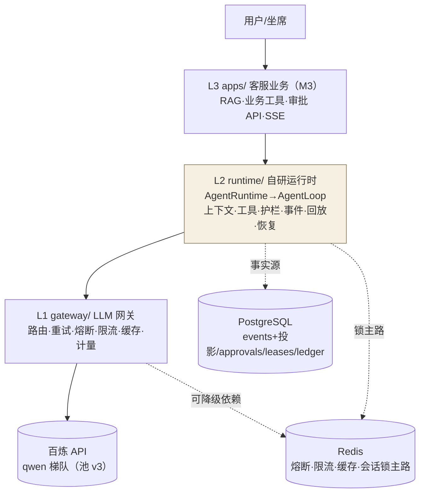

一句话："LLM 是 CPU，Aegis 是操作系统"（ADR-001）；依赖严格单向 L3→L2→L1。

---

## 图组 B：L1 网关

### B1 一次请求的九步旅程（router.complete）

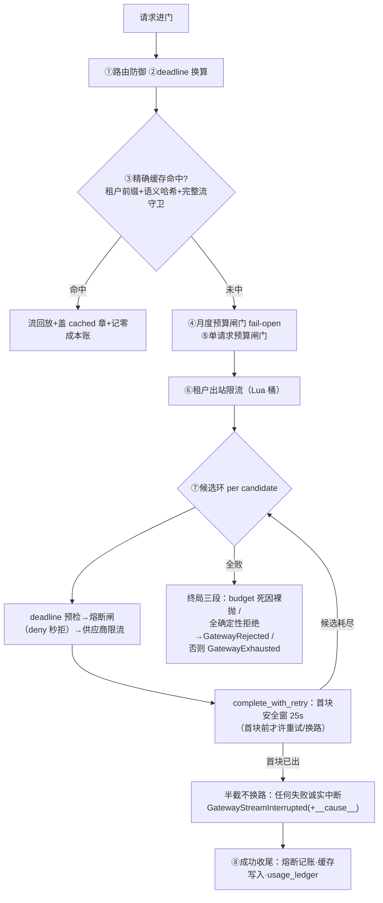

### B2 熔断三键状态机（Redis TTL 即迁移）

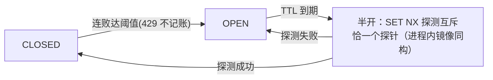

深挖跳转：retro-m0-m1（三代半开实现）、interview-questions M1 节。

---

## 图组 C：L2 运行时

### C1 一次 run 的双轨旅程（产出轨 ≡ 事实轨，I4）

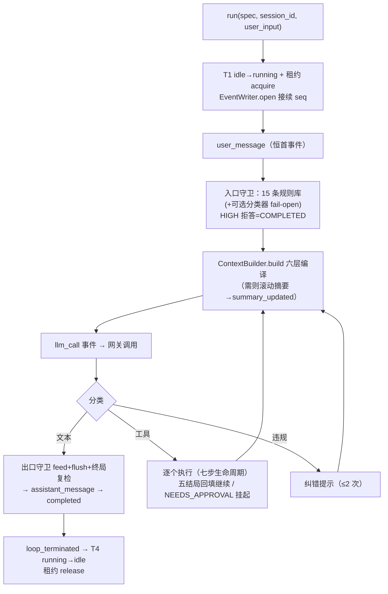

### C2 六道终止闸门的位置（7 类终止 + gateway_rejected 在七类外）

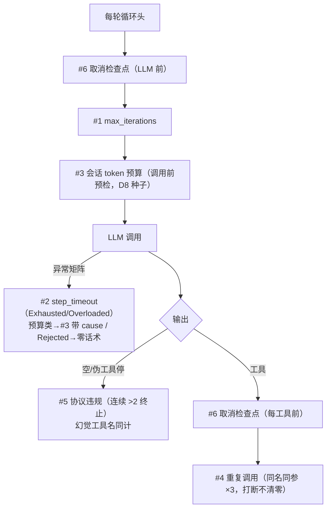

### C3 append 的三岔口（单写者 + 同事务投影）

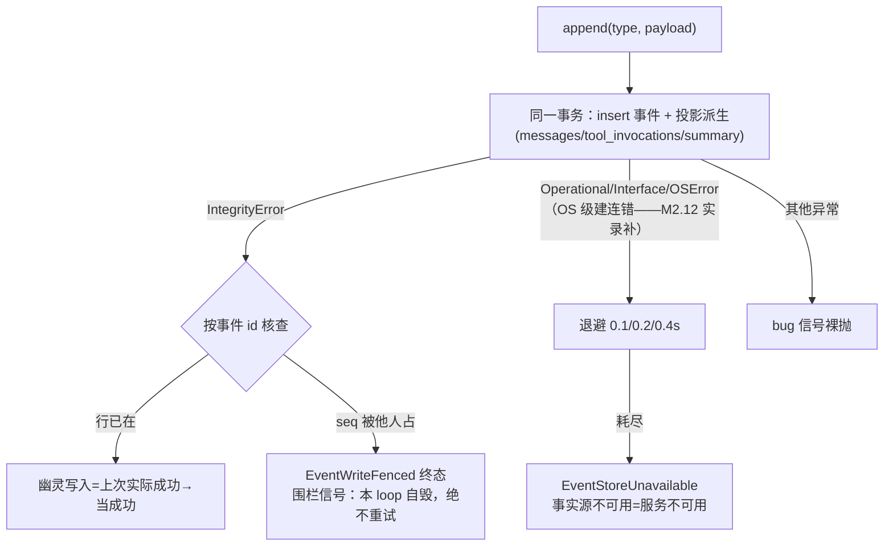

### C4 六层预算编译（ContextConfig 默认值）

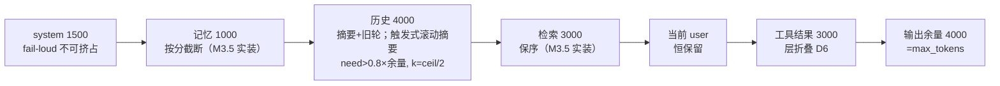

### C5 回放四道与匹配键（C10/C31）

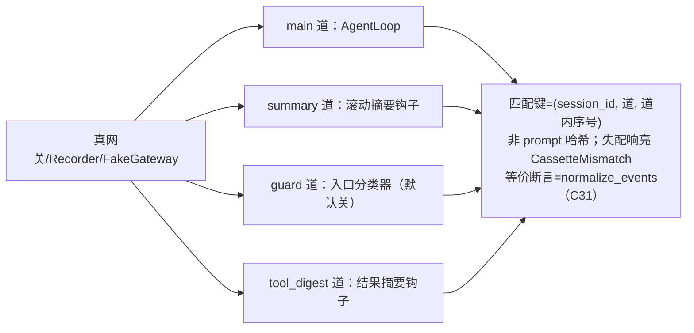

---

## 图组 D：L3 客服业务（M3.12 版）

### D1 意图路由四路分诊（fast 档单次调用，不是 Agent）

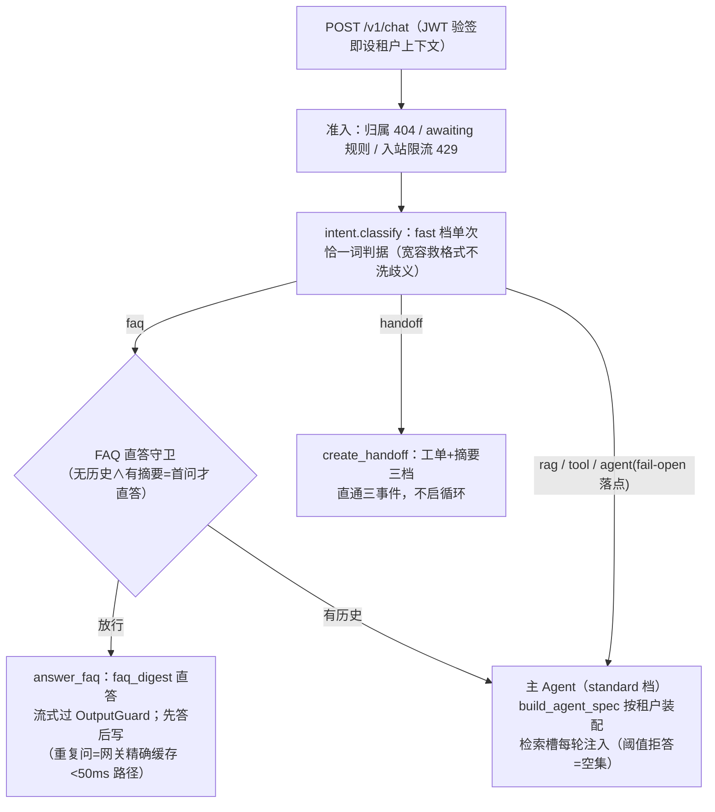

一句话：AGENT 刻意不在 prompt 词表——分诊失败的落点不是错误是"换一条同样正确的路"（C34/D8）。

### D2 一次 chat 的 L3 旅程（SSE 双通道 + HITL 支线）

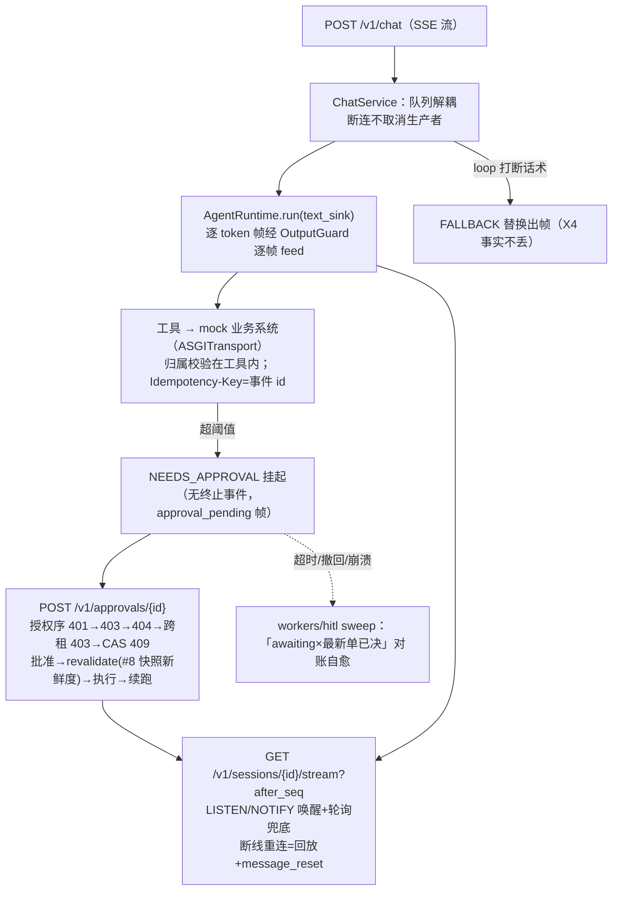

一句话：POST 是本次对话的流、GET 是会话事实的流——审批挂起数小时后续跑帧从 GET 通道瞬时推达（C22 实证）。

---

## 图组 E：治理层（M4.8 版）

### E1 治理五件套与数据流（谁读事实源、谁产凭证）

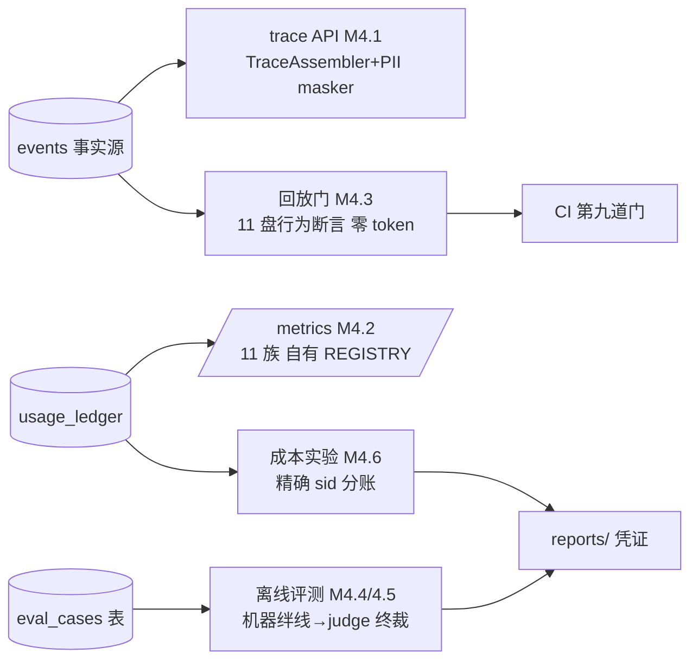

要点：可观测三件全部**从事实源派生**（"能派生的指标绝不重复计数"）；两条评测流水线目的不同
不可混（回放测行为零 token／评测测质量真实调用）；成本数字可由 ledger 复算（审计性即口径）。

### E2 容器拓扑（M4.7，#26/#31）

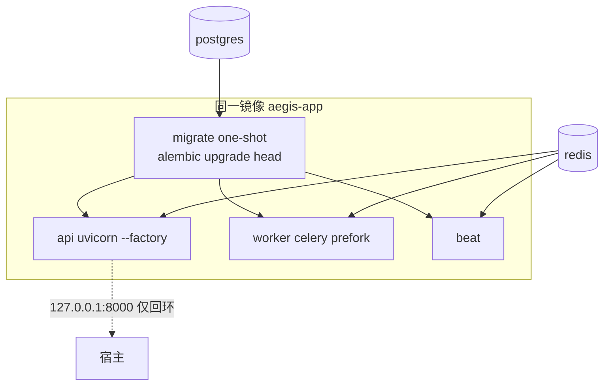

要点：migrate 先行（`service_completed_successfully`）=多副本永不抢迁移；应用容器
unless-stopped（保"手动停容器看降级"演示口径）；镜像内无 .env；**Linux prefork 世界
才有 kombu 自动 restore**（#48 两世界凭证：Windows=手动半、Linux=102s 零人工全自动）。
## 闸门与护栏总表（L1/L2/L3+治理档，M4.8 版）

| 拦截点 | 层 | 防什么 | 失败方向 | 代码锚 | 测试锚 |
|---|---|---|---|---|---|
| 三段超时 connect5/首块25/空闲30 | L1 | 挂起/慢流吃满资源 | 诚实中断 | providers/base + resilience:complete_with_retry | test_resilience |
| 首块安全窗口重试 | L1 | 重复输出（首块后重试） | 半截不换路 | resilience:complete_with_retry | test_resilience |
| 熔断三键+半开互斥 | L1 | 坏上游拖垮全站 | deny 秒拒（429 不记账） | breaker.py | test_breaker |
| 双维出站限流 Lua 桶 | L1 | 打爆供应商配额 | 排队≤10s；降级本地桶粘滞 | ratelimit.py | test_ratelimit |
| 精确缓存完整性守卫 | L1 | 半截流入库害后人 | 不完整不入库 | cache.py | test_cache |
| 月度预算闸门 | L1 | 烧穿月账 | **fail-open**（成本闸） | router:complete④+metering | test_budget |
| 单请求预算闸门 | L1 | 单发超大请求 | 拒绝（0=关） | router:complete⑤ | test_budget |
| 全池关思考 enable_thinking:false | L1 | 思考流饿死首块计时器+计费虚高 | 请求侧关闭（残留盲区 #41） | openai_compat:_build_payload | test_openai_compat |
| 密钥源头打码 | L1 | key 进日志/异常 | 源头消毒 | providers/base:sanitize_error_text | test_base |
| 闸门 #1–#6（六道终止） | L2 | 循环失控/预算烧穿/协议违规 | 兜底话术+loop_terminated | loop.py:_main_loop/_run_tools | test_loop_termination/adversarial |
| gateway_rejected 零话术 | L2 | 配置 bug 被话术掩盖 | 裸暴露（C6） | loop.py:_fail_llm_step | test_loop_gateway_errors |
| 前厅严校验 lax+forbid | L2 | 幻觉参数进工具 | 回填纠错 | executor:execute① | test_executor |
| 风险闸门 fail-closed | L2 | 高危写绕过审批 | 谓词崩溃=阻断 | executor:execute③ | test_executor |
| C15 注册期防呆 | L2 | 写工具裸奔 | import 时爆炸 | tools.py:@tool | test_tool_decorator |
| write-ahead 幂等键 | L2 | 崩溃期重复副作用 | 事件先落盘，id 透传下游 | executor:execute④ | test_recovery_replay/形态A |
| X1 结果不明 | L2 | 模型自发重试写操作 | 回填"禁止重试" | executor:execute⑤ | test_executor_exec |
| 连败禁用（2 次/轮） | L2 | 坏工具反复拖垮 | 本轮禁用 | executor | test_executor_exec |
| 结果收缩+injected 留痕 | L2 | 工具结果撑爆上下文 | fail-open 截断+X4 | executor:execute⑥ | test_executor_normalize |
| system 层 fail-loud | L2 | 配置性超预算被静默吃掉 | ValueError | context:build① | test_context_layers |
| 滚动摘要 C34 | L2 | 摘要挂拖垮对话 | fail-open 丢轮兜底+日志 | context:_compose_history | test_context_summary |
| 入口规则库 15 条+分类器 | L2 | 注入/越狱 | HIGH 拒答=COMPLETED；分类器 fail-open | guardrails:check_input | test_guardrails_entry |
| wrap_untrusted 防伪标记 | L2 | 数据自带假结束标记越狱 | 确定性改写 | guardrails:wrap_untrusted | test_guardrails_output |
| OutputGuard+C23 owned | L2 | 系统提示/工具名/他人 PII 外泄 | 流中止损+终局替换；本人 PII 放行 | guardrails:OutputGuard | test_guardrails_output |
| 事件退避白名单 | L2 | 瞬态抖动杀 run / OS 级错裸穿 | 退避 3 次→EventStoreUnavailable | store:EventWriter.append | test_event_store |
| 围栏 EventWriteFenced | L2 | 双写者写坏事实源 | 终态自毁不重试 | store:append 三岔口 | test_event_store/test_lease |
| 会话锁+看门狗 | L2 | 同会话双写者 | 丢锁即停；降级 PG advisory 保互斥 | core/locks.py | test_locks/实录 redis |
| 租约伴飞 LeaseLost | L2 | 僵尸副本继续写 | 自毁零事件（C2） | runtime:_pump_with_lease | test_lease |
| C9 恢复次数上限 | L2 | 毒会话无限抢租 | 超限置 failed+审计 | workers/reaper+T5 | test_loop_recovery |
| 审批 expires fail-closed+CAS | L2 | 过期单被批/双坐席双批 | 过期拒翻；CAS 恰一赢家 | store:ApprovalStore.decide | test_approvals/test_suspend_resume |
| JWT 双密钥窗+弱钥硬错误 | L3 | 伪造身份/弱密钥上线 | 验签失败 401；<32B 启动炸 | api/auth.py | test_auth |
| 端点×角色矩阵 | L3 | 越权访问 trace/审批/用量 | 403（staff 面显式点名）/404（用户面不泄露存在性） | api 各端点 require_roles | test_auth/test_events_view |
| 会话归属校验 #19 | L3 | 读写他人会话 | 首见建行、此后双匹配、不符 404 | chat._ensure_session | test_admission |
| 入站限流（租户维度） | L3 | 单租户打爆平台 | 即问即答 429+真实 Retry-After | api/ratelimit.py | test_admission |
| RLS 九表兜底防线 | L3(DB) | 应用层 WHERE 漏写时串租 | USING+WITH CHECK 双子句空集 | 迁移 c895f9007bf7 等 | test_rls |
| 检索阈值拒答 | L3 | 低相关内容硬凑答案 | 全低于 0.35 返空=宁可说不知道 | rag/retrieve.py | test_retrieval/test_adversarial |
| 工具归属校验（对抗③） | L3 | 水平越权读写他人订单 | 统一话术拒绝，不泄露存在性 | tools/_shared.fetch_owned_order | test_tools_ownership/test_adversarial |
| coupon/approval 阈值 | L3 | 高危写绕过人审 | 超阈值挂审批；coupon 缺省 0=fail-closed | tools risk_policy | test_tools_contract |
| 审批 API 授权序+跨租 403（对抗④） | L3 | 跨租户批单 | 401→403 角色→404→403 跨租→409 CAS | api/approvals.py | test_approvals_api/test_adversarial |
| revalidate 前置校验重跑 #8 | L3 | TOCTOU：批准落锤时事实已变 | 快照新鲜度不过=否决不执行 | apps/support/revalidate.py | test_revalidate/demo_hitl 段D |
| FAQ 直答守卫 | L3 | 上下文盲窗答非所问 | 有历史一律进主 Agent | service.py 守卫 | test_service/demo_chat 幕B |
| 兜底话术+prompt 规则 3 具体化 | L3 | 知识库外先验编造 | 「没有找到」+品类禁令（软约束，判据=fallback_rate） | prompts.py 规则 3 | fallback_rate_m3 实录 |
| hitl 对账 sweep | L3 | 已决未续跑孤儿单 | 「awaiting×最新单已决」每轮重推 | workers/hitl.sweep_once | test_hitl |

---

**治理档（M4.8 补）**：

| 拦截点 | 层 | 防什么 | 失败方向 | 代码锚 | 测试锚 |
|---|---|---|---|---|---|
| 展示层 PII masker 单点 | obs | 事件原文经查询面外泄 | 打码失败=占位顶替（绝不拖垮查询） | obs/masking（复用 PII_RULES_V1） | tests/obs/test_masking |
| 回放行为门（11 盘四键期望） | CI | prompt/行为漂移静默混入 | 失配响亮红（C10 早于断言） | tests/replay | m4_replay_redgreen.txt |
| 评测预算闸 eval_run_token_budget | 脚本 | 批次烧穿 | 超限中止落 partial | run_eval:run_batch | test_eval_runner |
| 成本实验预算闸×2 | 脚本 | 实验烧穿 | 超限中止落 partial | experiment_cost_*（config 两字段） | 冒烟实录 |
| 计量掉账 sanity（sid 覆盖=驱动数） | 脚本 | fail-open 静默丢账污染数字 | 缺账中止不出报告 | experiment_cost_*:coverage | 两报告 |
| 跨 loop 单例哨兵 LoopBoundGuard | core | keep-alive 深处裸炸 | mock 严格抛／redis·http 响亮警告 | core/loopcheck | test_loopcheck |
| notifier 心跳 SELECT 1 | api | 黑洞形态静默失聪 | 探针失败→重连+唤醒在途者 | api/notify:_run | test_notify |
| alembic_version REVOKE | DB | 低权角色改迁移水位 | 42501 | 迁移 e5a1c7d94f02 | test_rls M4.7 节 |
## 每层文件表（L1/L2/L3+治理；行数为约值，职责一句话，深挖跳 08/retro）

| 文件 | 约行 | 职责一句话 | 最重要不变量 |
|---|---|---|---|
| gateway/schema.py | 95 | 统一协议：LLMRequest/四类 chunk 判别联合 | chunk 序：text*→tool*→usage→stop |
| gateway/errors.py | 80 | 三组六类异常契约 | ProviderError 永不穿出网关 |
| gateway/providers/base.py | 60 | 共享 httpx 客户端+错误消毒 | 密钥源头打码 |
| gateway/providers/openai_compat.py | 190 | 百炼方言：SSE 解析/工具组装/关思考 | 未见 [DONE] 即截断非成功 |
| gateway/resilience.py | 100 | 受控重试+首块安全窗 | 首块后进不可重试区 |
| gateway/breaker.py | 180 | 熔断三键+半开互斥+进程内镜像 | 探针恰一、429 不记账 |
| gateway/ratelimit.py | 200 | Lua 令牌桶双维+降级粘滞 | 原子读改写、Redis TIME 时钟 |
| gateway/cache.py | 150 | 租户前缀精确缓存 | 完整流才入库 |
| gateway/metering.py | 126 | usage_ledger+成本纯函数 | 钱用 Decimal 永不 float |
| gateway/router.py | 350 | 九步总装+候选环+故障注入 | 半截不换路 |
| core/tokens.py | 18 | 估算尺（CJK≈1/字） | 护栏用估算账单用实测 |
| core/locks.py | 289 | 会话锁三实现+粘滞降级 | 持锁中途绝不换后端 |
| runtime/spec.py | 169 | 注入面：终止枚举/策略/预算/AgentSpec | GATES len==6 |
| runtime/events.py | 72 | 16 类事件+AgentEvent | 无时间戳=确定性回放前提 |
| runtime/store.py | 520 | 五表 ORM+单写者+同事务投影+审批/租约/状态机 CAS | (session_id,seq) 唯一=物理底线 |
| runtime/tools.py | 300 | @tool 一次解析三产物+注册期防呆 | schema/args_model/handler 同源 |
| runtime/executor.py | 340 | 七步生命周期+五结局+reexecute | 写恒单次、事件先于副作用 |
| runtime/context.py | 355 | 六层预算编译+滚动摘要 | 同输入⇒逐字节同输出 |
| runtime/replay.py | 326 | cassette/四道回放/录制器/C31 | 失配响亮绝不静默错配 |
| runtime/guardrails.py | 565 | 三挂点防线+出口状态机 | 逐字符 feed≡整段 feed |
| runtime/loop.py | 655 | 循环骨架+六道闸门+异常矩阵 | yield 序≡seq 序（I4） |
| runtime/runtime.py | 560 | 门面+恢复单入口+租约伴飞+重建器 | 恢复保事实不保字节 |
| workers/reaper.py | 150 | 租约扫描 CAS 抢租+钩子恢复+C9 终局 | 判定权在 T5 transition |

**L3 篇（M3.12 增补；api/ 与 apps/ 主件）**：

| 文件 | 约行 | 职责一句话 | 最重要不变量 |
|---|---|---|---|
| core/tenancy.py | 200 | 租户/用户 ORM+TenantDirectory 60s 缓存 | config 运行期只读（种子即入口 D12） |
| core/tenant_ctx.py | 90 | ContextVar+begin 钩子 set_config 事务级 | 身份恒由边界建立（封闭名单五处） |
| api/auth.py | 150 | HS256 双密钥窗+角色矩阵执行器 | 弱钥 <32B=启动硬错误 |
| api/chat.py | 200 | POST /v1/chat SSE 化+准入阶梯 | peek 首帧保 409 契约 |
| api/approvals.py | 130 | 审批决策端点+owner 查读缝 | 授权序 401→403→404→403→409 |
| api/stream.py | 180 | GET 重订阅：回放+message_reset+活尾 | 双源取 max、关流两判据 |
| api/notify.py | 150 | PG LISTEN 独立连接+轮询兜底 | 伪唤醒安全=醒来一律重查 |
| apps/support/intent.py | 140 | 四路分诊+FAQ 直答 | 恰一词判据；失败落点 AGENT |
| apps/support/agent.py | 56 | AgentSpec 装配器（9 字段收尾） | 白名单点名未知名启动炸 |
| apps/support/service.py | 400 | ChatService 编排+帧译表+守卫 | 断连不取消生产者 |
| apps/support/rag/retrieve.py | 200 | 双开关召回+重排+槽位适配器 | 全低于阈值返空；fail-open 留痕 |
| apps/support/revalidate.py | 110 | #8 批准执行期快照新鲜度 | 未登记工具 fail-closed |
| apps/support/tools/（六件） | 300 | 五工具+_shared 归属/传输契约底座 | 拒绝三路逐字节同话术 |
| apps/support/mock_backend/ | 350 | 进程内模拟业务+幂等台账 | PK=幂等键、单事务去重 |
| workers/ingest.py / hitl.py | 200+230 | 摄取断点续传 / 审批对账 sweep | IS NULL 谓词即进度；不信翻转返回值 |

---

**治理层文件（M4.8 补）**：

| 文件 | 行数≈ | 职责一句话 | 最重要不变量 |
|---|---|---|---|
| obs/masking.py | 60 | 展示层 PII 打码单点（复用 guardrails.PII_RULES_V1） | 绝不抛异常；events 永存原文，脱敏只在展示出口 |
| obs/trace.py | 150 | TraceAssembler：事件→TraceView（耗时配对+账本聚合） | 账本聚合包 tenant_context（(58) 防线）；鉴权归端点 |
| obs/metrics.py | 170 | 自有 REGISTRY 11 族+refresh_db_metrics | 刷新走 owner 维护面；族间隔离失败留上次值 |
| obs/evaluation.py | 77 | 评测双表 ORM（eval_cases=RLS 第十表） | enabled 运营开关不被重跑冲掉 |
| core/loopcheck.py | 60 | 跨 loop 单例哨兵（㉝ 共性防线） | 首用绑定；同实例跨 loop 才报；替身重绑定豁免 |
| tests/replay/ | 700 | 回放行为门（manifest+DRIVERS 三族） | 盘面≡manifest≡DRIVERS 三向完整性 |
| scripts/run_eval.py | 470 | 离线评测 runner（绊线→judge 分层判定） | 绊线只管召回；judge 与被评共用唯一 sid 精确对账 |
| scripts/experiment_cost_*.py | 660 | 成本对照两实验（双基线/两相位+全命中自检） | 数字可由 ledger 复算；对不上先修再报数 |
| Dockerfile+deploy/compose | 160 | 单镜像四服务编排 | migrate 先行；镜像无密钥；宿主端口仅回环 |
## 失败哲学总表（v1.0 终稿速记版；全文与代码锚见 retro-m0-m1 §5 / retro-m2 §6 / retro-m3 §5）

| # | 哲学 | 一句话 | 出处 |
|---|---|---|---|
| 1 | 失败方向三分 | 安全闸 fail-closed / 成本闸 fail-open / 缓存计量绝不拖垮请求 | 00 §2.2 |
| 2 | 半截不换路 | 首块后只能诚实中断；L2 镜像=半截 llm_call 作废重发 | C1/D10 |
| 3 | 事实源至上 | 事件先于副作用（write-ahead）；事实源不可用=服务不可用 | C2/02 §5 |
| 4 | 增强层 fail-open | 辅助 LLM 挂→确定性兜底+留痕，绝不拒答用户 | C34 |
| 5 | 响亮失败 | 失配/围栏/越权一律炸响，静默错配是最大的恶 | C10/C6 |
| 6 | 断言钉语义不钉巧合 | 过滤式断言（空间）+时序无关断言（时间）+形状与语义互补（M2.12） | M2.10/M2.12 教训 |
| 7 | 重试前提是无副作用 | 幂等是请求属性不是错误属性；LLM 补全可重试、写工具 retries 恒 0 | M1 哲学 #3 |
| 8 | 429 不进熔断账 | 限流是配额信号不是健康信号；异常分类学=谁的错/能不能重试 | M1 哲学 #4 |
| 9 | 配置错误启动时炸 | parse_routes 齐档校验 / gt=0 防呆 / prod 禁注入——错配活不过启动 | M1 哲学 #6 |
| 10 | write-ahead+键透传才是真幂等 | 事件 id 先 durably committed 再执行副作用并当下游幂等键；裸 order_id 是错误粒度 | M2 哲学 #2 |
| 11 | 三道防线守并发写 | 单写者→(sid,seq) 唯一约束→围栏自毁；不抢锁，谁先写进 seq 谁赢 | M2 哲学 #3 |
| 12 | 闸门都是"调用前查" | 预算/轮数在发起昂贵调用前查，不打半截请求 | M2 哲学 #4 |
| 13 | 可确定重算才许进回放面 | 墙钟/usage/指纹要么不进逻辑要么比较时豁免 | M2 哲学 #6 |
| 14 | 失败语义属于消费边界 | 共享核心不定失败方向；抛给第一个有替代路径的层（能力决定处置权） | M3 哲学 #1/#3 |
| 15 | fail-open 落点必须是类型内合法值 | 不许僭越某个正常值；"要什么"由参数定、"你是谁"只由边界定 | M3 哲学 #2/#6 |
| 16 | 恰好一次=至少一次×幂等消费 | 投递语义与执行语义分开验证 | M3 哲学 #5 |
| 17 | 观察者不改变事实 | sink/通道只作用于呈现面；可续传性=帧能否寻址到事实，通知不带数据一律重查 | M3 哲学 #7/#8 |
| 18 | 判据的绿可能只是世界恰好简单 | 判据强度随语料/数据几何定期换代；绊线只管召回、判定权分类收放 | M3 哲学 #9 / M4.5③ |
| 19 | fail-open 必须配对身份上下文 | 计量静默空账三例（(58) 家族：M4.2 伪码/M4.4 judge/M5.4 裸驱动）——fail-open 的代价是掉账无声，配对纪律+对账脚本是防线 | (58) 家族 |
| 20 | 凭证不掺假 | 空账即断言失败不出报告；口径限定语随数字走；盲区非零调用要声明上界 | M4.6/M5.2/M5.4 |
| 21 | 簿记在流尾 | on_success/计量都记在流耗尽处——半途弃流既不计量也不闭合熔断，实验与生产同一条铁律 | #10 实测/口径② |

---

## 数字凭证卡（v1.0 终稿版；每个数字有 reports/ 凭证与口径——README §实测数字是对外精选面）

| 数字 | 口径 | 凭证 |
|---|---|---|
| 成功率 100%（1000/1000）、P99 2.42s | 30% 注入/重试≤3/1 层 fallback | m1_fault_injection.txt |
| 熔断打开后 1.0–1.3ms | 100% 注入单候选，deny 秒拒 | 同上 |
| 限流精度误差 0.19%（524/525） | 预热后稳态、双模式同值 | m2_ratelimit_degraded.txt |
| kill -9 恢复四断言全 PASS | write-ahead 后真 kill→reaper 认领→续跑 | m2_kill9_recovery.txt |
| 40 轮长对话、摘要 2 次、五探针全中 | 真实录制 ¥0.0678/83k token；六跑迭代 ≈¥0.55 揪出六项缺陷 | m2_long_dialog_recording.txt |
| 真实冒烟三不变量 PASS、¥0.001004 | standard 档、只断不变量 | m2_real_smoke.txt |
| 停 Redis 并发恰一互斥 / 停 PG 退避明确终止 | 真容器实录；后者抓出 OS 白名单盲区（修复 98e2549） | m2_degradation_redis/pg.txt |
| 测试 548、CI 六道门、零真实调用 | 两处例外均已消耗 | ci.yml+00 §6.3 |
| 缓存命中中位 10.2ms / 首 token P50=1408 P95=2239ms | 本地单机；fast 二发全流 / standard 档 20 唯一样本 | m3_acceptance.md §2 |
| 兜底触发率 100%（5/5） | 种子集 okb 口径；三轮闭环 60→80→100（编造修复+判据反哺） | m3_acceptance.md §4 |
| 检索阈值 0.35（分离窗 [0.334,0.452]） | 真实语料两轮校准；对抗①字面核证 | calibrate 脚本 docstring |
| L3 五盘 cassette、8 调用 ¥0.006 | 预算写死 40/10 万/¥2；自检先于落盘 | m3_l3_recording.txt |
| M3 真实调用总账 <¥0.10 | 摄取+校准+录制三轮+性能两轮+兜底三轮 | usage_ledger+各凭证 |
| 测试 852（M3 +299）、四大对抗 CI 集中面 | test_adversarial 7 测+各步行为面 | ci.yml+00 §7.3 |

**M4 治理档**：

| 数字 | 口径 | 凭证 |
|---|---|---|
| 评测稳定基线 38/40=95% | 40 用例三类；两条已知失败=强先验编造样本有名有姓 | eval_baseline_20260803.txt |
| judge spot-check ±1 一致率 100% | 25 条异族复评（Claude vs qwen3.7-max），口径如实非严格盲评 | m4_judge_spotcheck.txt |
| 档位路由降本 vs-strong 74.7%/vs-standard 18.9% | 80 条全唯一集、双基线、缓存关、B 组含分诊成本 | m4_cost_routing.txt |
| 精确缓存降本 21.9% | 30% 复述假设显式声明；请求级全命中自检 60/60 | m4_cost_cache.txt |
| kill -9 自动恢复 102s（Linux 容器，零人工） | vt=60s 实验尺度+定时器 10s 节拍+重新消费；账本=理论批数零重复计费 | m4_kill9_ingest_linux.txt |
| M4 真实调用总账 ¥1.2488 | 账本五族聚合可复算（红线口径 00 §8.0） | m4_acceptance.md |

**M5 交付档**：

| 数字 | 口径 | 凭证 |
|---|---|---|
| 熔断恢复闭合 32.5/31.7/32.3s（≤32.5s） | D8：上游恢复→首探针成功且键清零；open TTL 30s 主导 | m5_breaker_recovery.txt |
| 档内容灾切换 20/20 + ledger 20 行同步 | qwen-plus 100% 注入；熔断不开=C5/D9 预期（provider 粒度+清零） | m5_failover_qwen_tier.txt |
| 压测三档 619 稳态请求 0 错误；平台开销 P99 ≤1.4s | 口径①：LatencyModelProvider 注入、开销=TTFT−基线 21.6s（失真两条在报） | m5_loadtest_overhead.txt |
| 真实上游首 token P50 1306ms（P99 4116ms） | 口径②：N=100 串行 standard；计量盲区（首块即断流）≤¥0.03 已声明 | m5_real_first_token.txt |
| demo 四高光排练 4 遍全绿、机器时间 <1min | 四列分镜+逐段计时登记；#14 降级复验凭证行在内 | docs/demo-script.md |
| 测试 1003、CI 十二道门、零真实调用 | (58) 家族第三例修正在 M5.4 排练首遍暴露并重跑归账 | ci.yml+00 §9 |

## 已知边界汇总（v1.0 终稿版；详见各 retro §7 与 00 §10.1-bis）

- 思考型模型首块饥饿盲区：现处置=全池关思考；关不掉思考的模型入池需活性信号（00 #41，M4.0）；
- `_pump_with_lease` finally 段次生异常可顶掉原始异常（plans/m2.12 偏差 #7，M4.0 候选）；
- 半开探针高负载偶发时序缝（M1 遗留，M4.0 备查）；出口 PII 仅式样化四类、银行卡列 v2；
- 长期记忆/检索槽位空置（M3.5）；幂等键下游去重此刻是假下游（M3.7 闭环）；
- 恢复"保事实不保字节"：打断/纠错话术无事件不重建；孤儿轮使恢复段 prompt 与原始不同（est 漂移）；
- 摘要生成长度理论无界（复盘补丁三终裁显式接受，`b628ce4`）：prompt 由版面份额保护（`_SUMMARY_PROMPT_SHARE=0.5`，仅近轮排队时生效——最新轮盲窗已关闭），跑飞代价=summarize 成本上升（ledger 可见）；事件恒存模型原话——落库 clip 让租户策略污染事实、max_tokens 把半句残话写进事实源，双双否决。

**M3 复盘观察池归档（M4.0④c 三档归位的"边界"档，17 条；账本全文见 00 §10.1-bis）**：
- **认证面**：JWT 无续约机制——v1 只做到期引导，**滑动过期是陷阱**（会拆掉"短 TTL 压住无撤销"这条唯一对策），refresh 双票制归 v2（⑧）；SSE 认证是**连接级一次性**、流内不重校验 exp，窗口由关流两判据收口在一次 run 时长内（⑨）。
- **摄取与检索面**：切块产物非原文子串且无偏移列 → **引用溯源 v1 结构上不可能**（⑯）；摄取链并发防护不成套（v1 无可达并发路径，前提已显式冻结，⑰）；API 摄取入口无去重，同文两传得两套 chunks 稀释 top_k——对照 seed_demo 反有三分支幂等，**两入口一幂等一不幂等**（⑲）。
- **意图与直答面**：恰一词判据把四词当等价代价，**handoff 误判有真副作用**且对否定语境盲（概率极低+话术末句是缓冲，㉕）；直答失败回落时 POST 已推 token 不可撤回且**无 message_reset 分隔信号**，与 GET 通道形成投影分岔——"观察者不改变事实"的一处例外（㉘）；直答"先答后写"崩溃窗：用户看到完整答案、事件流零记录、msgbuf 有残影（㊷）。
- **工具与下游面**：归属校验到写请求之间的窗口，**判据是窗口时长不是窗口是否存在**（普通调用毫秒级接受，HITL 的 3600s 已由 revalidate 覆盖，㉟）；`app.state.tickets` 无界内存列表（工单事实在事件流，mock 的 list 只是假下游收件箱，㉛）；直读 mock_orders 是 v1 形态前提，M4.7 真实化后三条理由全部反转（(55)）。
- **帧协议面**（M3.10 SSE 双通道的结构性取舍）：`last_tool` 跨事件携带依赖"工具串行"**未声明前提**——并行工具会让两处译表同时错且无红灯，**帧协议比投影协议弱**（投影层靠 `tool_call_id` 不受影响，㊿）；`msgbuf` 定位=**写的时候当副本、读的时候当事实**（两个正解方向各有不可接受代价：降格则断线丢半句、升格则每 token 一次事件，v1 取中间态并接受后果，(52)）；`text_sink` 三处 resume 调用点全不传，穿透在生产空转、唯一证人是测试（(65)）；单频道 `aegis_events` 全租户广播（v1 非泄漏，payload 仅路由键；分频道与"任意副本服务任意租户"冲突，(69)）；`poll_interval_s` **一个旋钮两用途**（降级节拍想调小 × 重连退避想调大，方向相反且从未分别论证，(70)）；帧协议**没有"消息边界"概念、`done` 在兼职** → 直答类重放时多条连成一个气泡，真正的修法是 message_start/end 帧对=协议升级归 v2（(75)）。

**M3 追加**：RLS 只覆盖带 tenant_id 的九表（P5 拍板：events/messages/tool_invocations 三表靠端点矩阵+归属校验，补列=动 M2 冻结面）；审批 veto 认领路径单据保持未回填（与 _resume_locked veto 一致，登记边界）；兜底判定机器信号集是启发式绊线（假阳性/漏报两向都实录过，语义终裁归 M4.4 judge）；prompt 规则 3 品类禁令是软约束（统计优化，fallback_rate 复测为准）；tickets/coupons 台账内存字典重启即清（D9 显式声明）；评测集 5 条 okb 分母的 100% 待 M4.5 扩集复测。

---

- （M4）msgbuf 定位=写时副本读时事实的中间态（(52) 站 11 裁决）；终局守卫在通道模式止损≈0（D11 显式接受）；
- （M4）worker 装配无 msgbuf → worker 驱动续跑重连无 message_reset（(64) 声明在场，实时性不对称已登记）；
- （M4）帧协议无消息边界、done 兼职（(75)）；`poll_interval_s` 一旋钮两职（(70)）；单频道全租户广播（(69)）；
- （M4）JWT 续约零机制=v1 到期引导（滑动过期是陷阱）；SSE 认证连接级一次性（⑧⑨）；
- （M4）检索引用溯源 v1 结构不可能（切块非原文子串，⑯）；FAILED 文档已回填块照常进检索（⑫ 数据面半）；
- （M4）compose scale 受 container_name+宿主端口双拦（M5.3 已摘除）；approvals 断连全弧 M5.4 已实录清账（demo 高光2：kill 副本+3s 断连批准，事实面闭环）；
- （M5）provider 粒度熔断对"单模型坏死"钝感——档内容灾实录坐实 C5/D9（fallback 即这层防线；v2 细化 provider:model）；压测口径① TTFT 原始值含守卫整段 flush 失真（开销减法不受影响，报告口径段声明）；口径② ledger 为计量盲区（首块即断流不达流尾——与 #10"簿记在流尾"同族）；手动 `docker kill` 的副本不被 unless-stopped 自启（Docker 语义，demo 分镜已列）。
## 复习路径（v1.0 终稿；三条按可用时间取用）

- **15 分钟速览**：图 A1（全景）→ B1（网关请求旅程）→ C1（运行时事件流）→ E1（治理层）
  → 闸门与护栏总表扫一遍 → 数字凭证卡（M5 档在末尾）→ 05 §1 简历模板默读一遍；
- **2 小时（面试前一天）**：retro 三篇 §哲学（m0-m1 §5 / m2 §6 / m3 §5）+ 本表失败哲学
  21 条速记 → interview-questions **全刷**（编号连续，M5 节收尾；每题先自答再看锚点）
  → 命运表两张（compare-langchain-m1 §7 / compare-langgraph-m2 §7）→ 已知边界汇总
  （防"完美系统"陷阱——每条都能主动说出）→ 05 §4 AI 协作三段背到脱稿；
- **半天（完整重建）**：00 §1-§3 定位 + 各里程碑对账表过一遍（步→提交→测试数增量）
  → 08 code-map 对着源码走三层 → ADR 7 篇（每篇能复述"当时另一个选项为什么输"）
  → 亲手跑一遍 demo（`scripts/demo_m5_highlights.py all`，栈起法见 README Quickstart）
  + `uv run pytest tests/replay -q`——高光肌肉记忆比背稿可靠。
